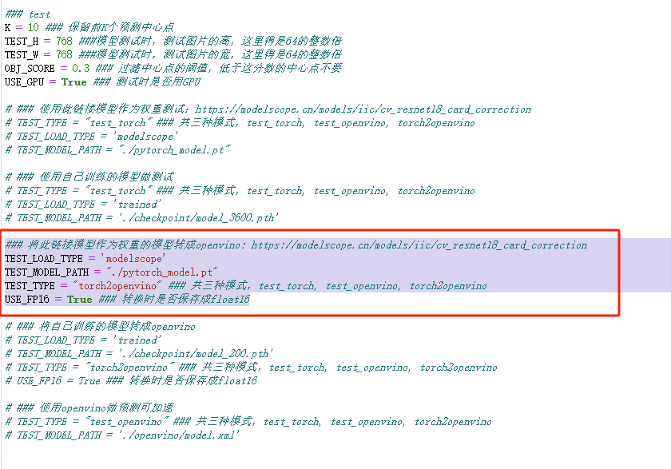
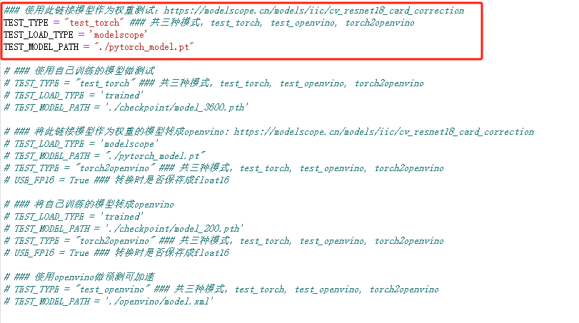
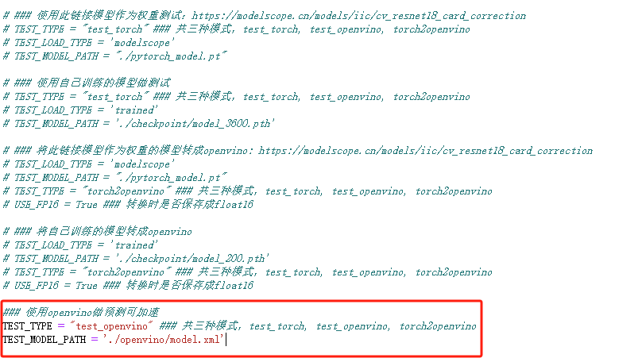
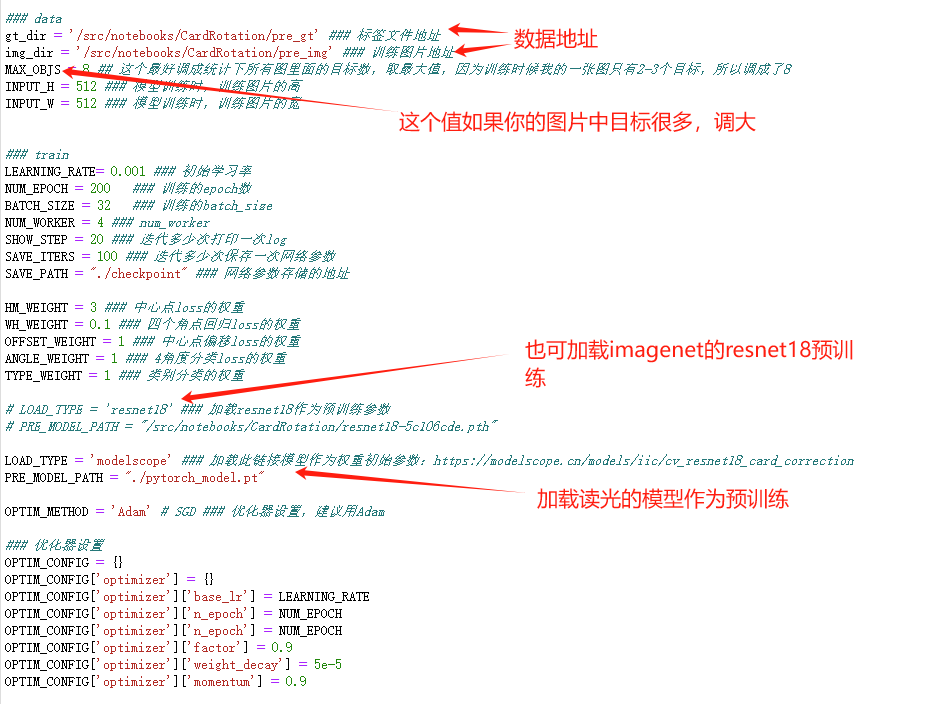
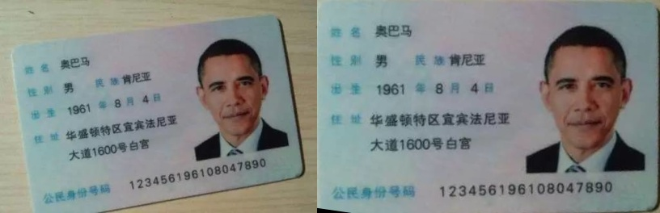
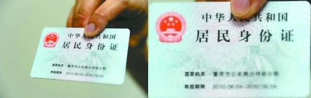
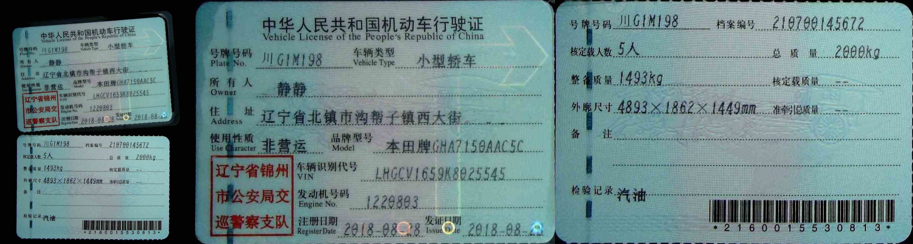
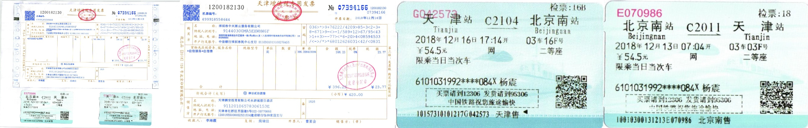

### 卡证矫正和文档矫正
##### 写在前面
模型和思路来源： [读光-票证检测矫正模型](https://modelscope.cn/models/iic/cv_resnet18_card_correction)，试了下效果不错，但是因为没开源训练模块，索性自己撸了下，数据加载dataload模块其实还是有优化空间的，比如我没对训练图片做光照，加噪等数据扩增操作。

#### 环境安装

python环境: 3.8.5及以上

```
pip install -r requirements.txt
```

#### torch模型转成openvino

配置好config.py文件，如下所示：


运行：
```
python infer.py
```

#### 模型测试
##### 使用pytorch测试
配置好config.py文件，如下：



运行：
```
python infer.py
```

##### 使用openvino测试
配置好config.py文件，如下：




运行：
```
python infer.py
```

##### 速度对比
测试环境：V100(16G), 18CPU

在CPU上跑，openvino的加速还是比较明显的， 尤其是在linux上，加速特别明显。时间对比如下:

| 方法      |     时间（s）|   
| :-------- | --------:| 
| pytorch（GPU）|   0.04027719497680664 |
| pytorch（CPU）|   0.5020792007446289 |
| openvino|   0.13443317413330078 |
 

### 模型训练

##### 数据准备

按如下结构准备数据集
```
images
│   1.jpg
│   2.jpg   
│		...
labels
│   1.txt
│   2.txt
│		...
```

label的标注格式是：

```
x1, y1, x2, y2, px1, py1, px2, py2, px3, py3, px4, py4, angle_class, type
```
x1,y1,x2,y2 是目标的矩形框的左上角点和右下角点坐标。
px1, py1, px2, py2, px3, py3, px4, py4是目标的四个角点。
angle_class是四个角度的分类,表示将图片顺时针旋转（0, 90, 180, 270），值分别为 0,1,2,3。
type表示文件的类别，比如读光-票证检测矫正模型中将文件分为2类，复印件和非复印件，你也可以根据自己的需要设置分类。


##### 模型训练

配置好config.py文件：


其他参数可根据需要自己调整

运行

```
python train.py
```

### 模型效果
每张图第一张为原图，右边为矫正的结果，这里直接加载的读光的模型，具体也可以去[读光-票证检测矫正模型](https://modelscope.cn/models/iic/cv_resnet18_card_correction)自己去试试，效果还是很不错的。





### 参考文献
https://modelscope.cn/models/iic/cv_resnet18_card_correction
https://github.com/modelscope/modelscope
https://github.com/xingyizhou/CenterNet