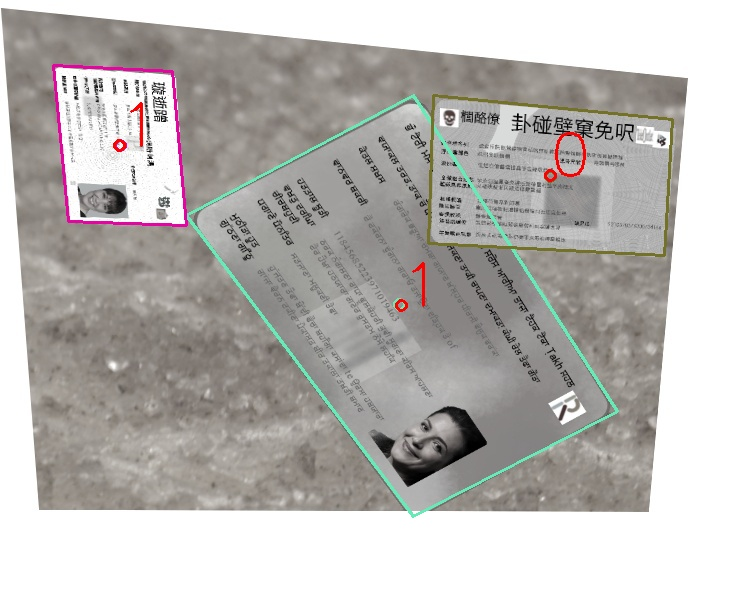
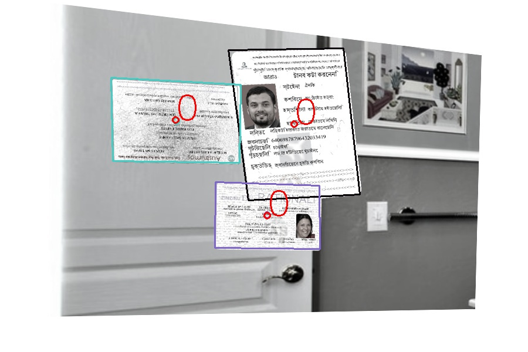
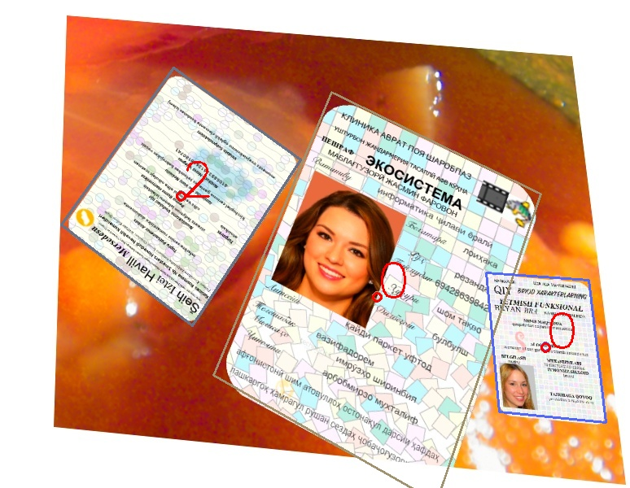
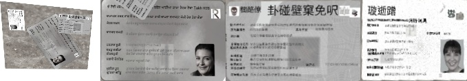
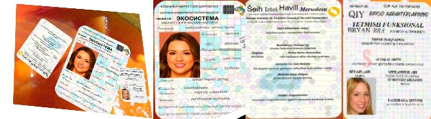

### 卡证矫正和文档矫正
##### 写在前面
模型和思路来源： [读光-票证检测矫正模型](https://modelscope.cn/models/iic/cv_resnet18_card_correction)，试了下效果不错，但是因为没开源训练模块，索性自己撸了下。

#### 环境安装

python环境: 3.8.5及以上

```
pip install -r requirements.txt
```

#### torch模型转成openvino

配置好config.py文件，如下所示：


运行：
```
python infer.py
```

#### 模型测试
##### 使用pytorch测试
配置好config.py文件，如下：


运行：
```
python infer.py
```

##### 使用openvino测试
配置好config.py文件，如下：


运行：
```
python infer.py
```

##### 速度对比
测试环境：V100(16G), 18CPU

在CPU上跑，openvino的加速还是比较明显的， 尤其是在linux上，加速特别明显。时间对比如下:

| 方法      |     时间（s）|   
| :-------- | --------:| 
| pytorch（GPU）|   0.04027719497680664 |
| pytorch（CPU）|   0.5020792007446289 |
| openvino|   0.13443317413330078 |
 

### 模型训练

##### 数据准备

按如下结构准备数据集
```
images
│   1.jpg
│   2.jpg   
│		...
labels
│   1.txt
│   2.txt
│		...
```

label的标注格式是：

```
x1, y1, x2, y2, px1, py1, px2, py2, px3, py3, px4, py4, angle_class, type
```
- x1,y1,x2,y2 是目标的矩形框的左上角点和右下角点坐标。
- px1, py1, px2, py2, px3, py3, px4, py4是目标的四个角点。
- angle_class是四个角度的分类,表示将图片顺时针旋转（0, 90, 180, 270），值分别为 0,1,2,3。
- type表示文件的类别，比如读光-票证检测矫正模型中将文件分为2类，复印件和非复印件，你也可以根据自己的需要设置分类。


##### 模型训练

配置好config.py文件：


其他参数可根据需要自己调整

单卡

```
CUDA_VISIBLE_DEVICES=0 python -m torch.distributed.launch --nproc_per_node=1 --master_port 1234 train.py
```

四卡

```
CUDA_VISIBLE_DEVICES=0,1,2,3 python -m torch.distributed.launch --nproc_per_node=4 --master_port 1234 train.py
```

##### 卡证生成数据集

[合成卡证数据集](https://modelscope.cn/datasets/shaoxuan/SyntheticCards)

[合成卡证数据转换脚本](./scripts/tranform_label.py)

##### 卡证生成数据集测试结果

测试环境：16C 32G CPU （Intel(R) Xeon(R) Gold 6132 CPU @ 2.60GHz）

| 模型      |     Recall |   Precision| CornerDistance| modelSize (M)| CPU latency (ms)|
| :-------- | :------:| :------: | :------: |:------: |:------: |
| resnet18 |   0.9935|  0.9931666666666666|24.09381134557724|40.9|583.6937427520752
| resnet18 openvino float32| 0.9935|  0.9931666666666666|24.09381134557724|40.8|125.51871538162232
| resnet18 openvino float16|   0.9935|  0.9931666666666666|24.109347816228865|20.4|111.98193883895874
| lcnet(scale=0.3)|   0.9729166666666665|  0.9700833333333331  |39.85471574521065|3.37|129.83580589294433
| lcnet(scale=0.3) openvino float32|   0.9729166666666665|  0.9700833333333331  |39.854713185071944|3.26|63.21316957473755
| lcnet(scale=0.3) openvino float16|   0.9724166666666665|  0.969833333333333|39.85092159843445|1.63|45.74410676956177
| replcnet(scale=0.3)|   0.9755833333333331|  0.9764166666666664|37.711453496456144|3.47|121.13970041275024|
| replcnet(scale=0.3) openvino float32|   0.9755833333333331|  0.9764166666666664|37.711442487716674|3.29|62.01917886734009
| replcnet(scale=0.3) openvino float16|   0.9752499999999998 |  0.9760833333333332|37.638311850070956|1.65|45.31275033950806

##### 生成卡片检测效果




##### 生成卡片矫正效果





### 模型效果
每张图第一张为原图，右边为矫正的结果，这里直接加载的读光的模型，具体也可以去[读光-票证检测矫正模型](https://modelscope.cn/models/iic/cv_resnet18_card_correction)自己去试试，效果还是很不错的。


### 参考文献
- https://modelscope.cn/models/iic/cv_resnet18_card_correction
- https://github.com/modelscope/modelscope
- https://github.com/xingyizhou/CenterNet
- https://github.com/PaddlePaddle/PaddleClas
- https://github.com/DingXiaoH/RepVGG